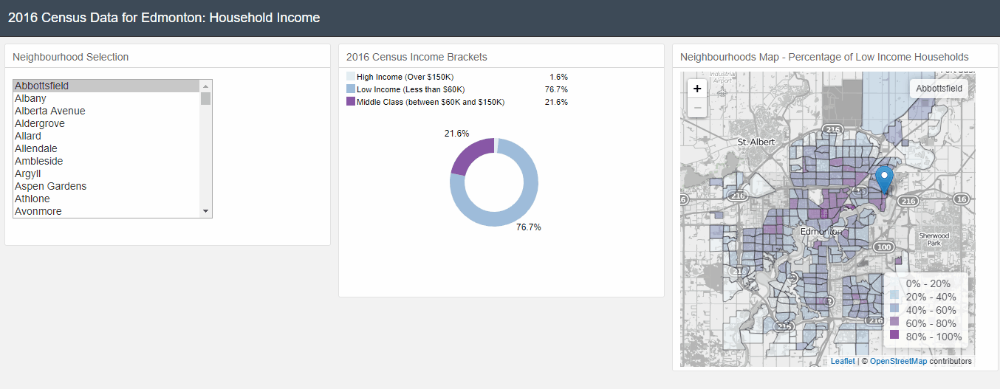

# Edmonton Census Insights by Neighbourhood

There are two main goals for this project.

* Look at the 2016 census data for Edmonton neighborhoods to try to glean insights into the economic distribution of YEG residents.
* Learn how to use d3 to create a dashboard for visualizing GIS data

I definitely learned a lot from this project. Features and improvements I am working on with this project.

## Neighbourhood Selection Option

- [x] use dc.selectionMenue to select a neighbourhood to highlight
- [ ] remove the default "select all" option since that doesn't make sense with this type of data

## Pie Chart showing the breakdown of Household income brackets

- [x] show the percentage of households in each income bracket
- [x] mouseover shows the bracket and percentage
- [x] format the values in the legend and mouseover to show percentage instead of the decimal format the data is saved as
- [ ] format the income bracket name. The "easy" way would be to change it in the .csv file... but I am interested in seeing if I can figure out how to do it via code. If this was python I would use a dictionary

## Map of Edmonton Neighborhoods

- [x] display a clickable, zoomable, draggable map using OpenStreetMap
- [x] color the neighbourhoods based on whether there are more "low income" households or "middle class" households in that neighbourhood.
- [x] on click display a popup with the neighbourhood name and the boolean integer value for >low income (1) or >middle class (0)
- [ ] format the legend so it tells you which color is  >low income VS >middle class.

## Sources

The census data comes from the city of Edmonton open data portal

[YEG 2016 Census by household income](https://data.edmonton.ca/Census/2016-Census-Population-by-Household-Income-Neighbo/jkjx-2hix)

[YEG 2016 Census Population by Age Range](https://data.edmonton.ca/Census/2016-Census-Population-by-Age-Range-Neighbourhood-/phd4-y42v)

[YEG neighbourhood boundaries](https://data.edmonton.ca/Geospatial-Boundaries/City-of-Edmonton-Neighbourhood-Boundaries/jfvj-x253)

## Acknowlegdments

I ran in Mikel Otis at Startup Edmonton and saw some his dashboards online where he has been playing around with some of Edmonton's Open Data. I've been wanting to do a project like this for awhile but wasn't sure where to start until I came across [Mikel Otis ByLaw Infractions Dashboard I](https://github.com/Edmonton-Open-Data/Edmonton-Bylaw-Infractions-I/blob/master/README.md#bylaw-infractions-dashboard-i). I stole heavily from his code/work as a starting point to figure this all out since I don't know JS. I'm pretty much a python guy! If you want to check out some of Mikel's other stuff then head over to his github page. [Mikel Otis PortFolio](https://mikelotis.github.io)
